# Test task in ISP (fuzzing)

Этот проект про применение фаззинга на open-source проекте на C/C++ с использованием AFL++. Выбранная программа, которая декодирует mp3 файлы: [minimp3](https://github.com/lieff/minimp3)

### Кастомная мутация

Кастомная мутация выполняет две главные задачи:

- Сохранение формата входных данных: Мутатор сохраняет общий формат MP3 файла после применения мутаций, что позволяет фаззеру эффективно работать с целевыми данными.
- Интеллектуальная мутация: Внесение изменений с учетом структуры MP3 файлов, что позволяет находить новые пути выполнения программы.

##### Моя мутация:
Мутация меняет фреймы в данных, изменяя отдельные байты с вероятностью 50%, и переставляет фреймы случайным образом, если размеры совпадают.

### Сравнение результатов

#### Графики
Два графика были созданы для сравнения результатов фаззинга с кастомной мутацией и без неё. Эти графики показывают количество обнаруженных путей с течением времени.

##### Функция mp3dec_decode_frame

График без кастомной мутации:

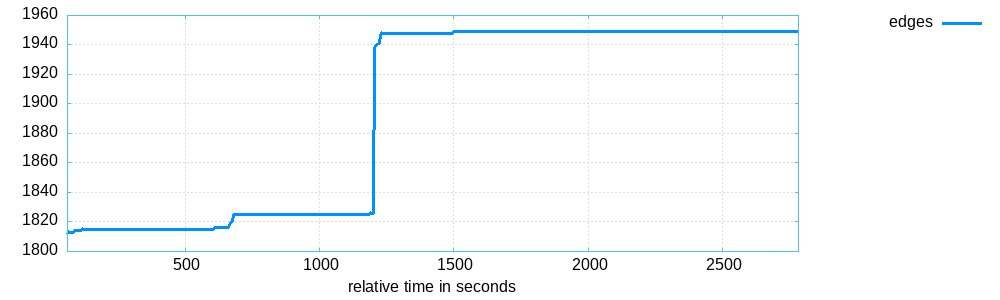

График онли с кастомной мутацией - изменение заголовка mp3 и перестановка фреймов файла:

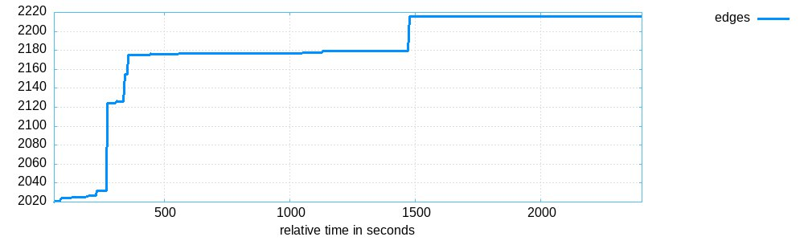


##### Функция mp3dec_ex_read

График без кастомной мутации:

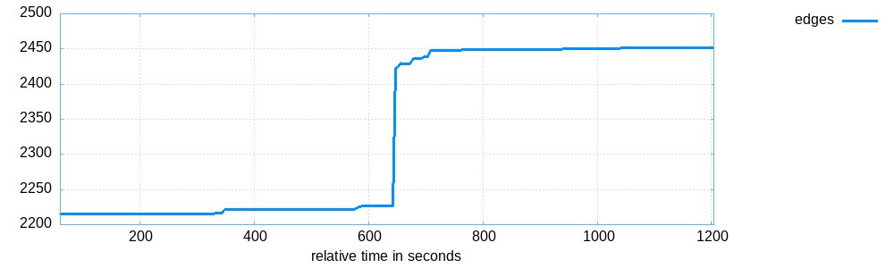

График онли с кастомной мутацией - изменение заголовка mp3 и перестановка фреймов файла:

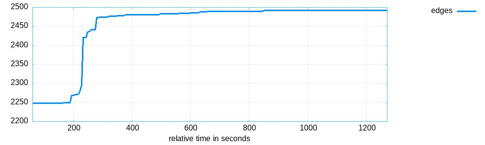

### Анализ
Графики показывают увеличение количества обнаруженных путей при использовании кастомной мутации по сравнению с использованием стандартных мутаций. Это показывает эффективность кастомного мутатора для MP3 файлов во время фаззинга.


## Моё искупление

### Про мутации
Чтобы увеличить покрытие при фаззинге моих таргетов, я решила написать кастомную мутацию (целых 2 шт!!!) для *.mp3.
Целями моего фаззинга являются функции  `mp3dec_decode_frame()` и `mp3dec_ex_read()`. Мутация для `mp3dec_decode_frame()` была неэффективна для `mp3dec_ex_read()` и наоборот. Поэтому было принято решение написать и использовать 2 мутации раздельно.

### Первая мутация(для функции `mp3dec_decode_frame()`)

Идея мутации: случайным образом изменять байты входных данных, чтобы создавать новые тестовые случаи.

Цикл проходит по каждому байту в буфере mutated_out. Для каждого байта с вероятностью MUTATION_RATE (50%) происходит мутация. Если случайное число, сгенерированное функцией rand(), меньше MUTATION_RATE, байт заменяется на случайное значение от 0 до 255.

```С
size_t afl_custom_fuzz(my_mutator_t* data, uint8_t* buf, size_t buf_size, uint8_t** out_buf, uint8_t* add_buf, size_t add_buf_size, size_t max_size) {
    size_t mutated_size = buf_size <= max_size ? buf_size : max_size;
    memcpy(data->mutated_out, buf, mutated_size);

    for (size_t i = 0; i < mutated_size; i++) {
        if ((rand() / (double)RAND_MAX) < MUTATION_RATE) {
            data->mutated_out[i] = rand() % 256;
        }
    }

    *out_buf = data->mutated_out;
    return mutated_size;
}
```

Результат приведен в виде графиков. Я построила три графика для трех разных случаев фаззинга: только с кастомной мутацией, без нее, и вместе с ней, но также с использованием дефолтных мутаций.

Без мутации:

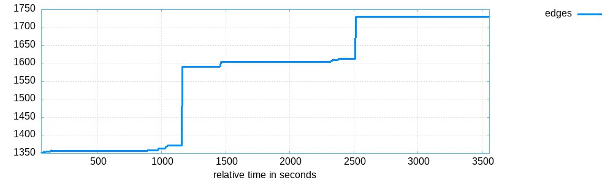

Только с кастомной мутацией:

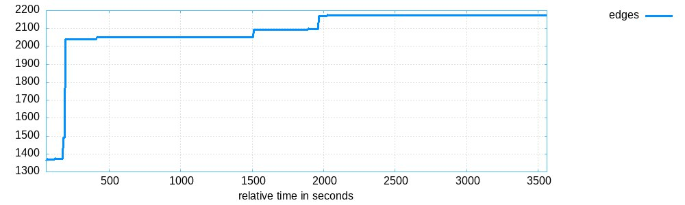

Кастомная + дефолтная мутации:

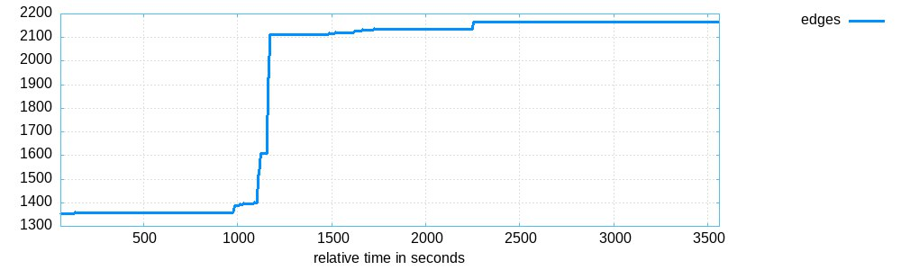

Анализ графиков: по графику custom only мутации видно, что со временем покрытие растет, что является хорошим знаком. Мы можем наблюдать, что использование кастомной мутации вместе с дефолтными выигрывает по сравнению с дефолтным, что наглядно демонстрирует эффективность моей мутации.


### Вторая мутация(для функции  `mp3dec_ex_read()`)
Идея мутации: изменять байты внутри MP3 фреймов и случайным образом переставлять фреймы, чтобы создать новые тестовые случаи. 

```c
    while (pos < mutated_size) {
        size_t frame_start = find_next_frame(data->mutated_out, mutated_size, pos);
        if (frame_start == mutated_size) break;  // Не найдено больше фреймов
        size_t next_frame_start = find_next_frame(data->mutated_out, mutated_size, frame_start + 1);
        
        for (size_t i = frame_start; i < next_frame_start && i < mutated_size; i++) {
            if ((rand() / (double)RAND_MAX) < MUTATION_RATE) {
                data->mutated_out[i] ^= 0xFF;  // Мутация байта
            }
        }

        if ((rand() / (double)RAND_MAX) < MUTATION_RATE) {

            size_t other_frame_start = find_next_frame(data->mutated_out, mutated_size, next_frame_start + 1);

            if (other_frame_start < mutated_size) {
                size_t other_frame_end = find_next_frame(data->mutated_out, mutated_size, other_frame_start + 1);
                size_t frame_size = next_frame_start - frame_start;
                size_t other_frame_size = other_frame_end - other_frame_start;

                if (frame_size == other_frame_size) {
                    for (size_t i = 0; i < frame_size; i++) {
                        uint8_t temp = data->mutated_out[frame_start + i];
                        data->mutated_out[frame_start + i] = data->mutated_out[other_frame_start + i];
                        data->mutated_out[other_frame_start + i] = temp;
                    }
                }
            }
        }
```


Без мутации:

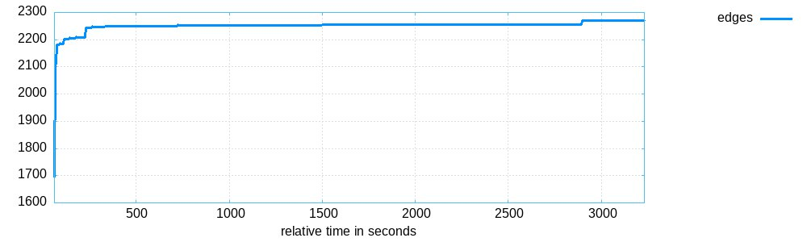

Только с кастомной мутацией:

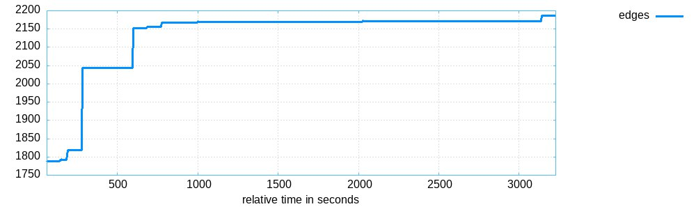

Кастомная + дефолтная мутации:

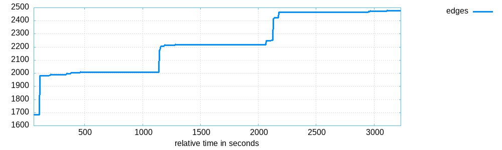

Без мутации:

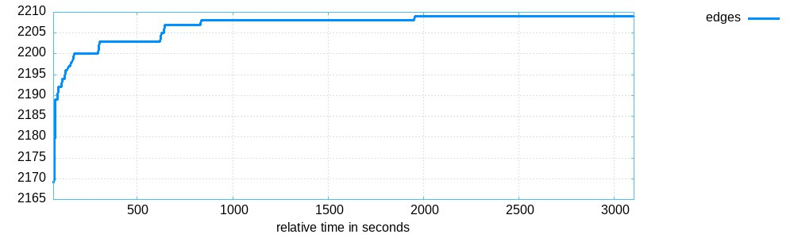

Только с кастомной мутацией:

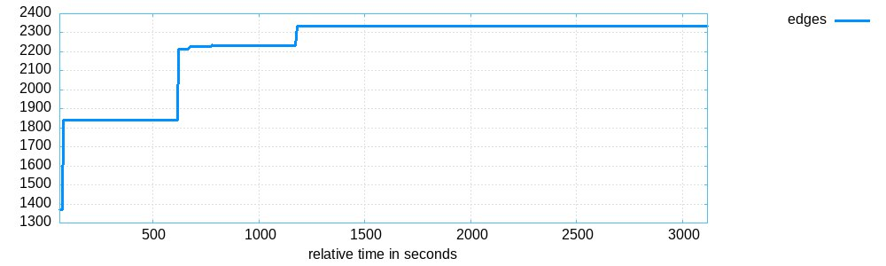

Кастомная + дефолтная мутации:

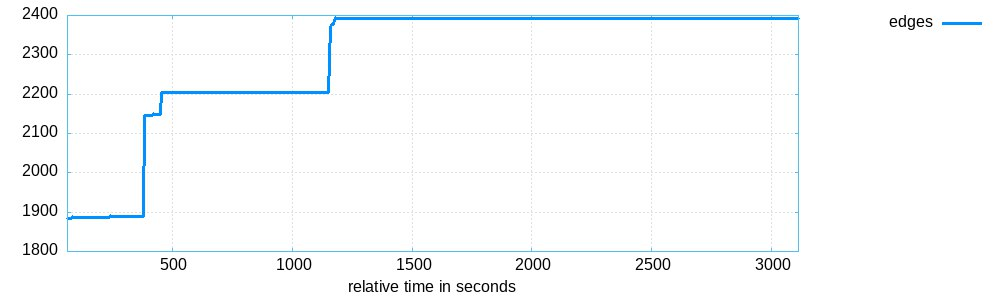

Анализ графиков: выводы по данным графикам можно сделать аналагичное первым: покрытие custom only растет, а мутация вносит свой вклад в увеличение покрытия. 


##### Провалы (в памяти :) ) из-за macOS 11
Изначально я пыталась выполнить задание на своем ноуте с macOS 11, однако постоянно сталкивалась с ошибками из-за старой версии macOS. Проблемы включали несовместимости с библиотеками и че-то дофига еще всего. При каждом шаге возникали какие-то ошибки, например, устаревшие зависимости, конфликты версий и отсутствие поддержки некоторых инструментов для macOS. Я долго пыталась что-нибудь с этим сделать, но в итоге решила перейти на другой ноут, потому что я и так уже ну оооочень много времени потратила на свой старый макос)))))))


##### Переход на Linux
Я перешла на ноутбук с Linux, и установка необходимых инструментов и библиотек прошла без проблем. (нужно было так сделать сразу..........)

##### Выбор проекта
Изначально я выбрала проект с pdf файлами. Я потратила день на изучение структуры PDF файлов и поняла, что ну чет... ну прям сложно как-то. Если учитывать то, что я этим занималась еще на своем старом ноуте, то там были постоянные проблемы с написанием мутаций, так еще и библиотеки для работы с pdf не устанавливались. (возможно, если бы я с пдфками че-то делала на linux, то может все бы и получилось). Но в итоге я решила просто перейти на mp3.

##### Использование готового таргета и создание новых
В проекте [minimp3](https://github.com/lieff/minimp3) уже был готовый фазз-таргет, который использовал одну из основных функций декодера MP3. Однако я  решила написать дополнительный таргеты к функции read. 


